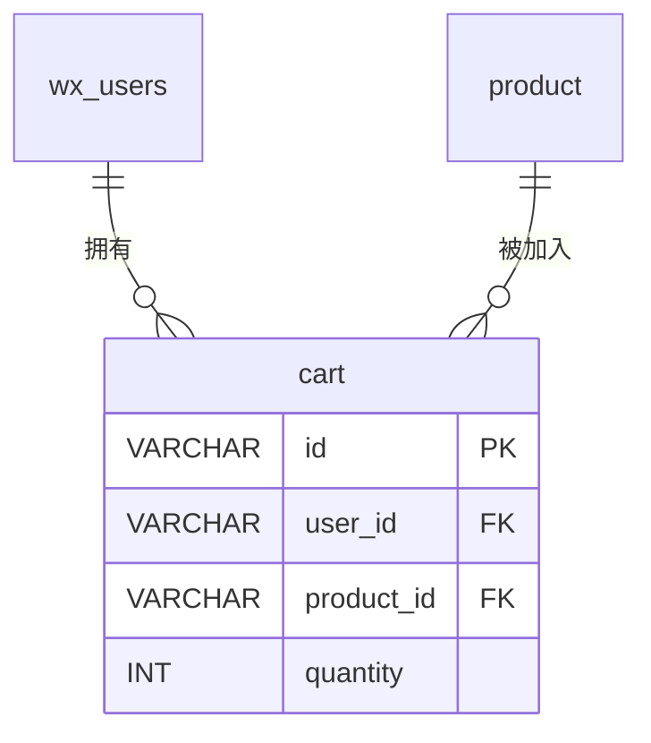

# cart - 购物车表

## 表说明

用户购物车表，记录用户添加到购物车的商品信息。

## 基本信息

| 属性 | 值 |
|------|-----|
| 表名 | cart |
| 引擎 | InnoDB |
| 字符集 | utf8mb4 |
| 排序规则 | utf8mb4_unicode_ci |
| 主键 | VARCHAR(32)（V33 后原 INT 自增改为 VARCHAR(32)） |

## 字段列表

| 字段名 | 类型 | 允许空 | 默认值 | 说明 |
|--------|------|--------|--------|------|
| id | VARCHAR(32) | 否 | - | 购物车ID（主键） |
| user_id | VARCHAR(32) | 否 | - | 用户ID（外键；V10 由 INT 改 VARCHAR） |
| product_id | VARCHAR(32) | 否 | - | 商品ID（外键） |
| quantity | INT | 是 | 1 | 数量 |
| selected | TINYINT | 是 | 1 | 是否选中: 0否 1是 |
| create_time | DATETIME | 是 | CURRENT_TIMESTAMP | 创建时间 |
| update_time | DATETIME | 是 | CURRENT_TIMESTAMP ON UPDATE | 更新时间 |

## 索引

| 索引名 | 索引字段 | 索引类型 | 说明 |
|--------|----------|----------|------|
| PRIMARY | id | 主键索引 | 主键 |
| uk_user_product | user_id, product_id | 唯一索引 | 用户商品唯一约束 |
| idx_user | user_id | 普通索引 | 用户购物车查询优化 |

## 关联关系

### 作为从表（引用其他表）

| 主表 | 外键字段 | 关系类型 | 说明 |
|------|----------|----------|------|
| [[wx_users]] | user_id | 多对一 | 购物车属于某个用户 |
| [[product]] | product_id | 多对一 | 购物车包含某个商品 |

## 关系图

## 唯一约束说明

`uk_user_product` 唯一索引确保同一用户对同一商品只有一条购物车记录。

## 选中状态说明

| 值 | 说明 |
|----|------|
| 0 | 未选中（结算时不包含） |
| 1 | 已选中（结算时包含） |