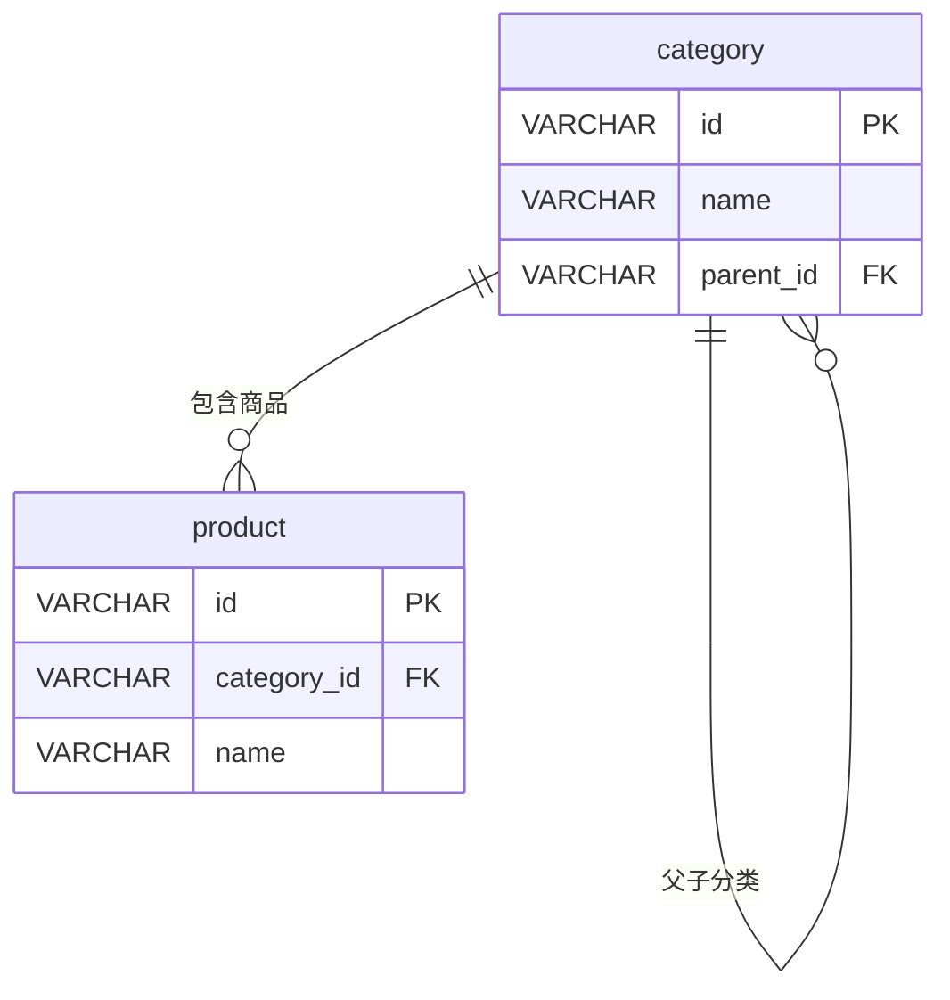

# category - 商品分类表

## 表说明

商品分类表，支持多级分类结构（树形结构）。

## 基本信息

| 属性 | 值 |
|------|-----|
| 表名 | category |
| 引擎 | InnoDB |
| 字符集 | utf8mb4 |
| 排序规则 | utf8mb4_unicode_ci |
| 主键 | VARCHAR(32)（V33 后原 INT 自增改为 VARCHAR(32)） |

## 字段列表

| 字段名 | 类型 | 允许空 | 默认值 | 说明 |
|--------|------|--------|--------|------|
| id | VARCHAR(32) | 否 | - | 分类ID（主键） |
| name | VARCHAR(50) | 否 | - | 分类名称 |
| parent_id | VARCHAR(32) | 是 | NULL | 父分类ID（自关联；V4 添加，V33 改 VARCHAR） |
| sort | INT | 是 | 0 | 排序（数字越小越靠前） |
| status | TINYINT | 是 | 1 | 状态: 0禁用 1启用 |
| remove | VARCHAR(10) | 是 | NULL | 删除标记（实体有、无迁移脚本，需核对实际库） |
| create_time | DATETIME | 是 | CURRENT_TIMESTAMP | 创建时间 |
| update_time | DATETIME | 是 | CURRENT_TIMESTAMP ON UPDATE | 更新时间 |

## 索引

| 索引名 | 索引字段 | 索引类型 | 说明 |
|--------|----------|----------|------|
| PRIMARY | id | 主键索引 | 主键 |
| idx_parent | parent_id | 普通索引 | 父分类查询优化 |

## 变更历史

- **V4 (2026-03-01)**: 新增 `parent_id` 字段支持二级分类，删除 `icon` 字段
- **V33**: id / parent_id 由 INT 改为 VARCHAR(32)

## 关联关系

### 自关联（树形结构）

| 关联字段 | 关系类型 | 说明 |
|----------|----------|------|
| parent_id | 多对一 | 指向父分类，形成树形结构 |

### 作为主表（被引用）

| 关联表 | 外键字段 | 关系类型 | 说明 |
|--------|----------|----------|------|
| [[product]] | category_id | 一对多 | 一个分类下有多个商品 |

### 作为从表（引用其他表）

| 主表 | 外键字段 | 关系类型 | 说明 |
|------|----------|----------|------|
| [[category]] | parent_id | 多对一 | 父分类 |

## 关系图



## 状态说明

| 状态值 | 说明 |
|--------|------|
| 0 | 禁用 |
| 1 | 启用 |

## 树形结构示例

```
分类树结构：
├── 一级分类A (id=A001, parent_id=null)
│   ├── 二级分类A1 (id=A001_001, parent_id=A001)
│   └── 二级分类A2 (id=A001_002, parent_id=A001)
└── 一级分类B (id=B001, parent_id=null)
    └── 二级分类B1 (id=B001_001, parent_id=B001)
```