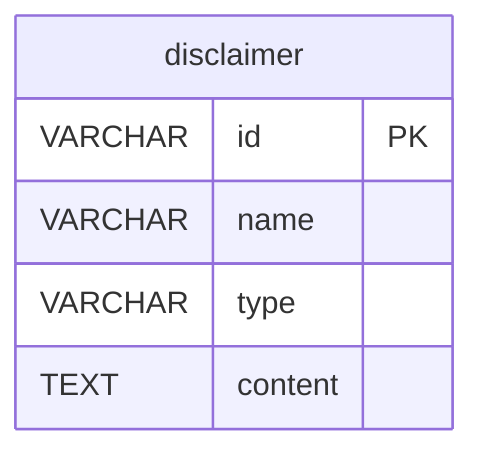

# disclaimer - 免责声明表

## 表说明

免责声明表，存储工具/商品的免责声明内容。

## 基本信息

| 属性 | 值 |
|------|-----|
| 表名 | disclaimer |
| 引擎 | InnoDB |
| 字符集 | utf8mb4 |
| 排序规则 | utf8mb4_unicode_ci |
| 主键 | VARCHAR(32) |

## 字段列表

| 字段名 | 类型 | 允许空 | 默认值 | 说明 |
|--------|------|--------|--------|------|
| id | VARCHAR(32) | 否 | - | 声明ID（主键） |
| name | VARCHAR(100) | 否 | - | 声明名称 |
| type | VARCHAR(50) | 是 | 'product' | 声明类型（默认 product） |
| content | TEXT | 是 | NULL | 声明内容 |
| status | TINYINT | 是 | 1 | 状态: 0禁用 1启用 |
| sort | INT | 是 | 0 | 排序 |
| create_time | DATETIME | 是 | CURRENT_TIMESTAMP | 创建时间 |
| update_time | DATETIME | 是 | CURRENT_TIMESTAMP ON UPDATE | 更新时间 |

## 变更历史

- **V35**: 创建免责声明表（含默认数据）

## 索引

| 索引名 | 索引字段 | 索引类型 | 说明 |
|--------|----------|----------|------|
| PRIMARY | id | 主键索引 | 主键 |
| idx_type | type | 普通索引 | 按类型查询 |
| idx_status | status | 普通索引 | 按状态查询 |

## 关联关系

该表没有外键关联关系。

## 关系图

## 状态说明

| 状态值 | 说明 |
|--------|------|
| 0 | 禁用 |
| 1 | 启用 |