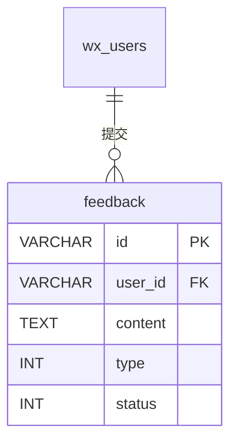

# feedback - 意见反馈表

## 表说明

用户意见反馈表，记录用户提交的反馈信息，支持多图上传。

## 基本信息

| 属性 | 值 |
|------|-----|
| 表名 | feedback |
| 引擎 | InnoDB |
| 字符集 | utf8mb4 |
| 排序规则 | utf8mb4_unicode_ci |
| 主键 | VARCHAR(32)（V33 后原 INT 自增改为 VARCHAR(32)） |

## 字段列表

| 字段名 | 类型 | 允许空 | 默认值 | 说明 |
|--------|------|--------|--------|------|
| id | VARCHAR(32) | 否 | - | 反馈ID（主键） |
| user_id | VARCHAR(32) | 否 | - | 用户ID（外键；V14 由 INT 改 VARCHAR） |
| content | TEXT | 否 | - | 反馈内容 |
| phone | VARCHAR(20) | 是 | NULL | 联系电话（实体有、V5 未含，需核对实际库） |
| images | TEXT | 是 | NULL | 图片（逗号分隔，最多3张） |
| type | TINYINT | 是 | 0 | 反馈类型: 0=普通意见反馈 1=工具需求反馈（V39） |
| status | TINYINT | 是 | 0 | 状态: 0待处理 1已处理 |
| reply | TEXT | 是 | NULL | 回复内容 |
| reply_time | DATETIME | 是 | NULL | 回复时间 |
| create_time | DATETIME | 是 | CURRENT_TIMESTAMP | 创建时间 |
| update_time | DATETIME | 是 | CURRENT_TIMESTAMP ON UPDATE | 更新时间 |

## 索引

| 索引名 | 索引字段 | 索引类型 | 说明 |
|--------|----------|----------|------|
| PRIMARY | id | 主键索引 | 主键 |
| idx_user | user_id | 普通索引 | 用户反馈查询优化 |
| idx_status | status | 普通索引 | 状态筛选优化 |

## 变更历史

- **V5 (2026-03-01)**: 创建意见反馈表
- **V14 (2026-03-12)**: user_id 字段类型由 INT 改为 VARCHAR(32)
- **V33**: id 由 INT 改为 VARCHAR(32)
- **V39 (2026-08-04)**: 新增 `type` 字段，区分普通意见反馈与工具需求反馈

## 关联关系

### 作为从表（引用其他表）

| 主表 | 外键字段 | 关系类型 | 说明 |
|------|----------|----------|------|
| [[wx_users]] | user_id | 多对一 | 反馈属于某个用户 |

## 关系图

## 状态说明

| 状态值 | 说明 |
|--------|------|
| 0 | 待处理 |
| 1 | 已处理 |

## 反馈类型说明

| 类型值 | 说明 |
|--------|------|
| 0 | 普通意见反馈 |
| 1 | 工具需求反馈（工具库中缺失的工具） |