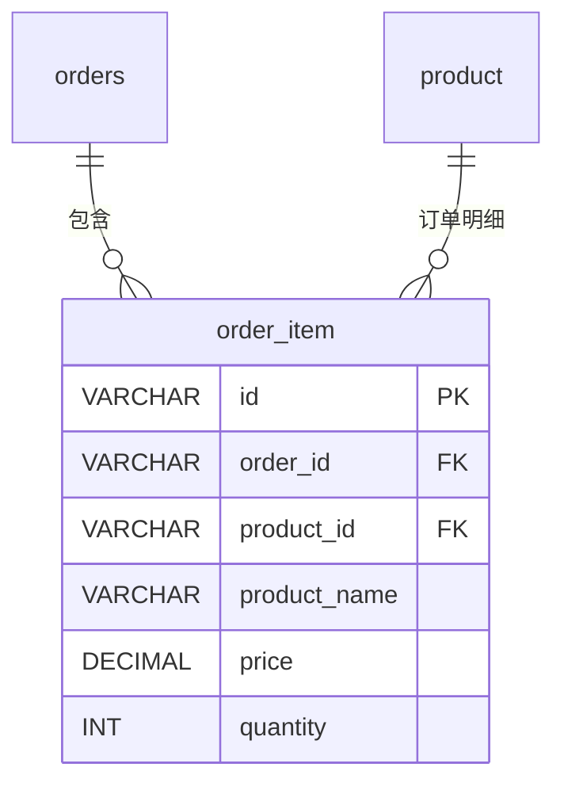

# order_item - 订单明细表

## 表说明

订单明细表，记录订单中每个商品的详细信息（含商品快照）。

## 基本信息

| 属性 | 值 |
|------|-----|
| 表名 | order_item |
| 引擎 | InnoDB |
| 字符集 | utf8mb4 |
| 排序规则 | utf8mb4_unicode_ci |
| 主键 | VARCHAR(32)（V33 后原 INT 自增改为 VARCHAR(32)） |

## 字段列表

| 字段名 | 类型 | 允许空 | 默认值 | 说明 |
|--------|------|--------|--------|------|
| id | VARCHAR(32) | 否 | - | 订单详情ID（主键） |
| order_id | VARCHAR(32) | 否 | - | 订单ID（外键） |
| product_id | VARCHAR(32) | 否 | - | 商品ID（外键） |
| product_name | VARCHAR(200) | 是 | NULL | 商品名称（快照） |
| product_image | VARCHAR(500) | 是 | NULL | 商品图片（快照） |
| price | DECIMAL(10,2) | 否 | - | 单价（快照） |
| quantity | INT | 否 | - | 数量 |
| total_amount | DECIMAL(10,2) | 是 | NULL | 小计 |
| create_time | DATETIME | 是 | CURRENT_TIMESTAMP | 创建时间 |

## 索引

| 索引名 | 索引字段 | 索引类型 | 说明 |
|--------|----------|----------|------|
| PRIMARY | id | 主键索引 | 主键 |
| idx_order | order_id | 普通索引 | 订单明细查询优化 |

## 关联关系

### 作为从表（引用其他表）

| 主表 | 外键字段 | 关系类型 | 说明 |
|------|----------|----------|------|
| [[orders]] | order_id | 多对一 | 明细属于某个订单 |
| [[product]] | product_id | 多对一 | 明细关联某个商品 |

## 关系图

## 数据快照说明

订单明细中的 `product_name`、`product_image`、`price` 字段存储的是下单时的商品快照，即使原商品信息发生变化，订单明细中的数据保持不变，确保历史订单数据的准确性。