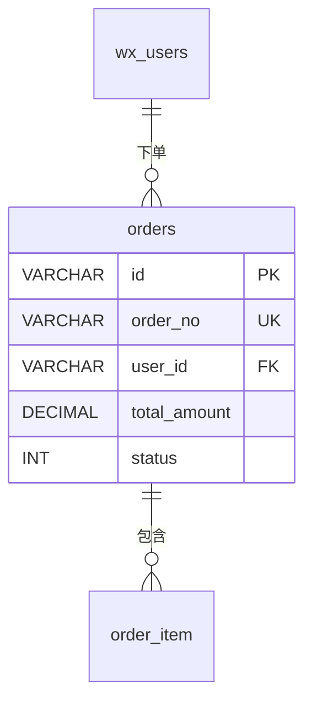
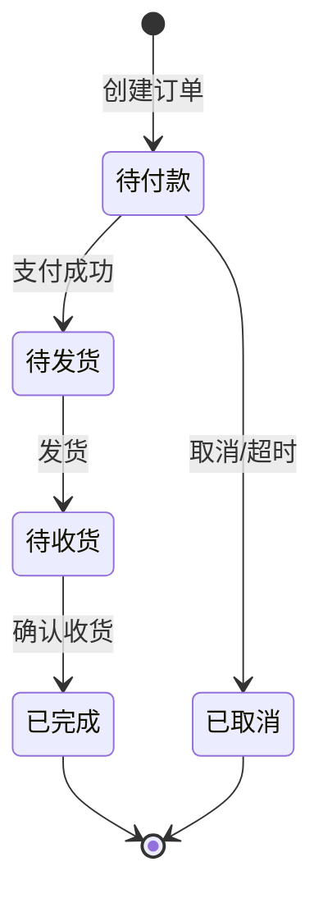

# orders - 订单表

## 表说明

用户订单表，记录用户的订单基本信息。

## 基本信息

| 属性 | 值 |
|------|-----|
| 表名 | orders |
| 引擎 | InnoDB |
| 字符集 | utf8mb4 |
| 排序规则 | utf8mb4_unicode_ci |
| 主键 | VARCHAR(32)（V33 后原 INT 自增改为 VARCHAR(32)） |

## 字段列表

| 字段名 | 类型 | 允许空 | 默认值 | 说明 |
|--------|------|--------|--------|------|
| id | VARCHAR(32) | 否 | - | 订单ID（主键） |
| order_no | VARCHAR(50) | 否 | - | 订单号（唯一） |
| user_id | VARCHAR(32) | 否 | - | 用户ID（外键；V10 由 INT 改 VARCHAR） |
| total_amount | DECIMAL(10,2) | 否 | - | 订单总价 |
| pay_amount | DECIMAL(10,2) | 是 | NULL | 实付金额 |
| status | TINYINT | 是 | 0 | 状态: 0待付款 1待发货 2待收货 3已完成 4已取消 |
| receiver_name | VARCHAR(50) | 是 | NULL | 收货人 |
| receiver_phone | VARCHAR(20) | 是 | NULL | 收货电话 |
| receiver_address | VARCHAR(255) | 是 | NULL | 收货地址 |
| remark | VARCHAR(255) | 是 | NULL | 备注 |
| pay_time | DATETIME | 是 | NULL | 支付时间 |
| deliver_time | DATETIME | 是 | NULL | 发货时间 |
| receive_time | DATETIME | 是 | NULL | 收货时间 |
| create_time | DATETIME | 是 | CURRENT_TIMESTAMP | 创建时间 |
| update_time | DATETIME | 是 | CURRENT_TIMESTAMP ON UPDATE | 更新时间 |

## 索引

| 索引名 | 索引字段 | 索引类型 | 说明 |
|--------|----------|----------|------|
| PRIMARY | id | 主键索引 | 主键 |
| uk_order_no | order_no | 唯一索引 | 订单号唯一约束 |
| idx_user | user_id | 普通索引 | 用户订单查询优化 |

## 关联关系

### 作为主表（被引用）

| 关联表 | 外键字段 | 关系类型 | 说明 |
|--------|----------|----------|------|
| [[order_item]] | order_id | 一对多 | 一个订单包含多个订单明细 |

### 作为从表（引用其他表）

| 主表 | 外键字段 | 关系类型 | 说明 |
|------|----------|----------|------|
| [[wx_users]] | user_id | 多对一 | 订单属于某个用户 |

## 关系图

## 订单状态说明

| 状态值 | 说明 | 触发条件 |
|--------|------|----------|
| 0 | 待付款 | 订单创建 |
| 1 | 待发货 | 用户支付 |
| 2 | 待收货 | 商家发货 |
| 3 | 已完成 | 用户确认收货 |
| 4 | 已取消 | 用户取消或超时 |

## 订单状态流转

