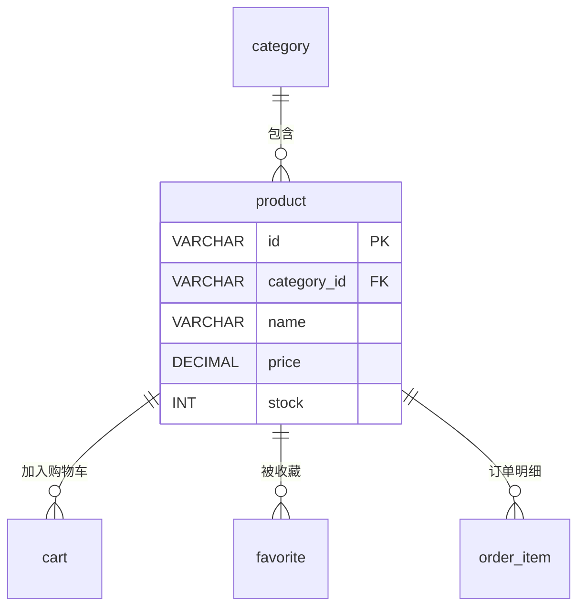

# product - 商品表

## 表说明

商品信息表，存储商品的基本信息、价格、库存等。

## 基本信息

| 属性 | 值 |
|------|-----|
| 表名 | product |
| 引擎 | InnoDB |
| 字符集 | utf8mb4 |
| 排序规则 | utf8mb4_unicode_ci |
| 主键 | VARCHAR(32)（V33 后原 INT 自增改为 VARCHAR(32)） |

## 字段列表

| 字段名 | 类型 | 允许空 | 默认值 | 说明 |
|--------|------|--------|--------|------|
| id | VARCHAR(32) | 否 | - | 商品ID（主键） |
| category_id | VARCHAR(32) | 是 | NULL | 分类ID（外键） |
| name | VARCHAR(200) | 否 | - | 商品名称 |
| image | VARCHAR(500) | 是 | NULL | 商品主图（完整URL） |
| images | TEXT | 是 | NULL | 商品图片（逗号分隔的完整URL） |
| description | TEXT | 是 | NULL | 商品描述 |
| price | DECIMAL(10,2) | 否 | - | 价格 |
| stock | INT | 是 | 100 | 库存 |
| sales | INT | 是 | 0 | 销量 |
| status | TINYINT | 是 | 1 | 状态: 0下架 1上架 |
| sort | INT | 是 | 0 | 排序 |
| unit | VARCHAR(20) | 是 | NULL | 单位 |
| origin | VARCHAR(100) | 是 | NULL | 产地 |
| remove | VARCHAR(10) | 是 | NULL | 删除标记（实体有、无迁移脚本，需核对实际库） |
| tags | VARCHAR(200) | 是 | NULL | 标签（实体有、无迁移脚本，需核对实际库） |
| is_pinned | TINYINT | 是 | 0 | 是否置顶（V34） |
| pin_sort | INT | 是 | 0 | 置顶排序（V34） |
| sort_order | INT | 是 | 0 | 综合排序（V34） |
| version | INT | 是 | 0 | 乐观锁版本号（V1） |
| create_time | DATETIME | 是 | CURRENT_TIMESTAMP | 创建时间 |
| update_time | DATETIME | 是 | CURRENT_TIMESTAMP ON UPDATE | 更新时间 |

## 索引

| 索引名 | 索引字段 | 索引类型 | 说明 |
|--------|----------|----------|------|
| PRIMARY | id | 主键索引 | 主键 |
| idx_category | category_id | 普通索引 | 分类查询优化 |

## 变更历史

- **V1 (2026-03-01)**: 新增 `version` 字段，用于乐观锁机制
- **V2 (2026-03-01)**: 图片存储方式变更，返回完整URL地址
- **V3 (2026-03-01)**: 删除 `original_price` 字段
- **V33**: id / category_id 由 INT 改为 VARCHAR(32)
- **V34 (2026-04-10)**: 新增 is_pinned / pin_sort / sort_order 字段

## 关联关系

### 作为主表（被引用）

| 关联表 | 外键字段 | 关系类型 | 说明 |
|--------|----------|----------|------|
| [[cart]] | product_id | 一对多 | 商品可被加入多个购物车 |
| [[favorite]] | product_id | 一对多 | 商品可被多个用户收藏 |
| [[order_item]] | product_id | 一对多 | 商品可出现在多个订单明细中 |

### 作为从表（引用其他表）

| 主表 | 外键字段 | 关系类型 | 说明 |
|------|----------|----------|------|
| [[category]] | category_id | 多对一 | 商品属于某个分类 |

## 关系图

## 状态说明

| 状态值 | 说明 |
|--------|------|
| 0 | 下架 |
| 1 | 上架 |

## 乐观锁说明

本表使用 `version` 字段实现乐观锁，防止并发更新时的数据冲突。