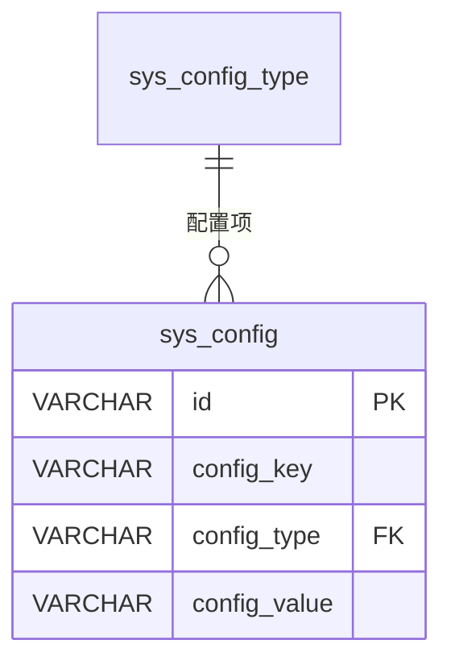

# sys_config - 系统配置表

## 表说明

系统配置表，存储系统各项配置参数（如商品单位等预置数据）。

## 基本信息

| 属性 | 值 |
|------|-----|
| 表名 | sys_config |
| 引擎 | InnoDB |
| 字符集 | utf8mb4 |
| 排序规则 | utf8mb4_unicode_ci |
| 主键 | VARCHAR(32) |

## 字段列表

| 字段名 | 类型 | 允许空 | 默认值 | 说明 |
|--------|------|--------|--------|------|
| id | VARCHAR(32) | 否 | - | 配置ID（主键） |
| config_key | VARCHAR(50) | 否 | - | 配置键（schema.sql 有、实体未映射） |
| config_type | VARCHAR(50) | 否 | - | 配置类型 |
| config_value | VARCHAR(100) | 是 | NULL | 配置值 |
| remark | VARCHAR(500) | 是 | NULL | 备注（实体有、schema 无，需核对实际库） |
| sort | INT | 是 | 0 | 排序 |
| status | TINYINT | 是 | 1 | 状态: 0禁用 1启用 |
| create_time | DATETIME | 是 | CURRENT_TIMESTAMP | 创建时间 |
| update_time | DATETIME | 是 | CURRENT_TIMESTAMP ON UPDATE | 更新时间 |

> ⚠️ `config_key`（schema.sql 有）与 `remark`（实体有）未同时出现在建表脚本与实体中，**需核对实际库**。

## 索引

| 索引名 | 索引字段 | 索引类型 | 说明 |
|--------|----------|----------|------|
| PRIMARY | id | 主键索引 | 主键 |
| idx_config_type | config_type | 普通索引 | 按类型查询配置 |
| idx_config_key | config_key | 普通索引 | 按键查询配置 |

## 关联关系

### 作为从表（引用其他表）

| 主表 | 外键字段 | 关系类型 | 说明 |
|------|----------|----------|------|
| [[sys_config_type]] | config_type | 多对一 | 配置属于某个配置类型 |

## 关系图

## 状态说明

| 状态值 | 说明 |
|--------|------|
| 0 | 禁用 |
| 1 | 启用 |

## 预置数据

系统预置的商品单位配置：

| config_type | config_key | config_value | sort |
|-------------|------------|--------------|------|
| product_unit | unit_1 | 个 | 1 |
| product_unit | unit_2 | 斤 | 2 |
| product_unit | unit_3 | 瓶 | 3 |
| product_unit | unit_4 | 袋 | 4 |
| product_unit | unit_5 | 盒 | 5 |
| product_unit | unit_6 | 包 | 6 |