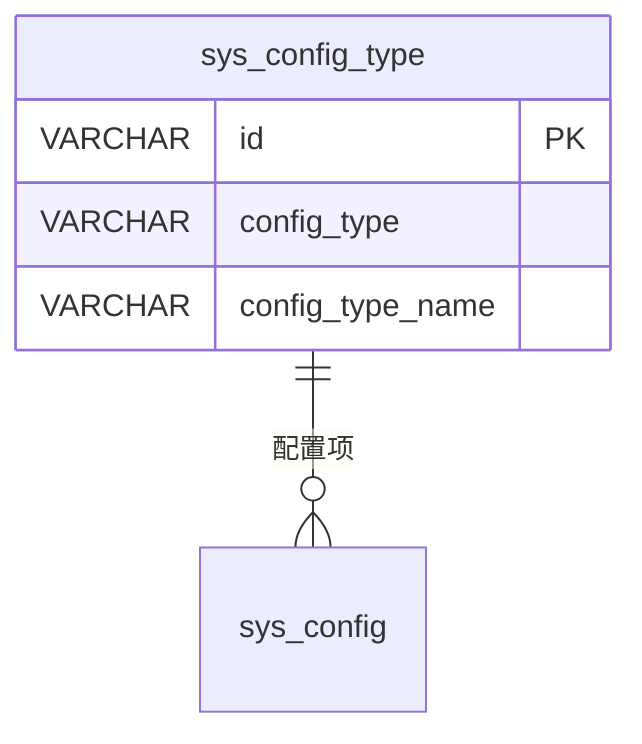

# sys_config_type - 配置类型表

## 表说明

配置类型表，定义系统配置的分类（如商品单位、租赁参数等）。

## 基本信息

| 属性 | 值 |
|------|-----|
| 表名 | sys_config_type |
| 引擎 | InnoDB |
| 字符集 | utf8mb4 |
| 排序规则 | utf8mb4_unicode_ci |
| 主键 | VARCHAR(32)（据实体推断；**无建表脚本，需核对实际库**） |

## 字段列表

| 字段名 | 类型 | 允许空 | 默认值 | 说明 |
|--------|------|--------|--------|------|
| id | VARCHAR(32) | 否 | - | 配置类型ID（主键） |
| config_type | VARCHAR(50) | 否 | - | 配置类型编码 |
| config_type_name | VARCHAR(100) | 否 | - | 配置类型名称 |
| remark | VARCHAR(500) | 是 | NULL | 备注 |
| sort | INT | 是 | 0 | 排序 |
| status | TINYINT | 是 | 1 | 状态: 0禁用 1启用 |
| create_time | DATETIME | 是 | CURRENT_TIMESTAMP | 创建时间 |
| update_time | DATETIME | 是 | CURRENT_TIMESTAMP ON UPDATE | 更新时间 |

> ⚠️ 本表**无建表迁移脚本**，以上结构据实体 `SysConfigType` 推断，字段（如 `remark`）及类型**需核对实际库**。

## 索引

| 索引名 | 索引字段 | 索引类型 | 说明 |
|--------|----------|----------|------|
| PRIMARY | id | 主键索引 | 主键 |

## 关联关系

### 作为主表（被引用）

| 关联表 | 外键字段 | 关系类型 | 说明 |
|--------|----------|----------|------|
| [[sys_config]] | config_type | 一对多 | 一个类型下有多个配置项 |

## 关系图

## 状态说明

| 状态值 | 说明 |
|--------|------|
| 0 | 禁用 |
| 1 | 启用 |