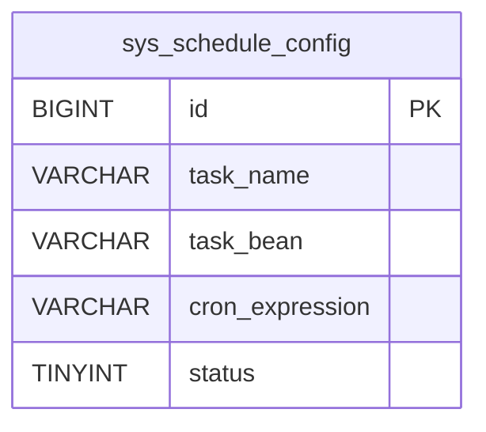

# sys_schedule_config - 定时任务配置表

## 表说明

定时任务配置表，定义系统定时任务的调度参数（任务名称、Bean、cron 表达式等）。

## 基本信息

| 属性 | 值 |
|------|-----|
| 表名 | sys_schedule_config |
| 引擎 | InnoDB |
| 字符集 | utf8mb4 |
| 排序规则 | utf8mb4_unicode_ci |
| 主键 | BIGINT 自增（V28 建表）／实体 `String`（`IdType.ASSIGN_ID`，**需核对实际库**） |

## 字段列表

| 字段名 | 类型 | 允许空 | 默认值 | 说明 |
|--------|------|--------|--------|------|
| id | BIGINT / VARCHAR | 否 | - | 任务ID（主键；实体为 String，需核对实际库） |
| task_name | VARCHAR(100) | 否 | - | 任务名称 |
| task_bean | VARCHAR(200) | 否 | - | 任务对应的 Spring Bean |
| cron_expression | VARCHAR(100) | 否 | - | cron 表达式 |
| execute_time_desc | VARCHAR(100) | 是 | NULL | 执行时间描述（运行时补充） |
| description | VARCHAR(500) | 是 | NULL | 任务描述 |
| status | TINYINT | 是 | 1 | 状态: 0禁用 1启用 |
| last_execute_time | DATETIME | 是 | NULL | 上次执行时间 |
| next_execute_time | DATETIME | 是 | NULL | 下次执行时间 |
| create_time | DATETIME | 是 | CURRENT_TIMESTAMP | 创建时间 |
| update_time | DATETIME | 是 | CURRENT_TIMESTAMP ON UPDATE | 更新时间 |

> ⚠️ 本表迁移脚本为 BIGINT 自增主键，但实体 `SysScheduleConfig` 主键为 String（`IdType.ASSIGN_ID`），两者存在矛盾，**需核对实际库**。

## 变更历史

- **V28**: 创建定时任务配置表

## 索引

| 索引名 | 索引字段 | 索引类型 | 说明 |
|--------|----------|----------|------|
| PRIMARY | id | 主键索引 | 主键 |
| uk_task_name | task_name | 唯一索引 | 任务名称唯一 |

## 关联关系

该表没有外键关联关系。

## 关系图

## 状态说明

| 状态值 | 说明 |
|--------|------|
| 0 | 禁用 |
| 1 | 启用 |