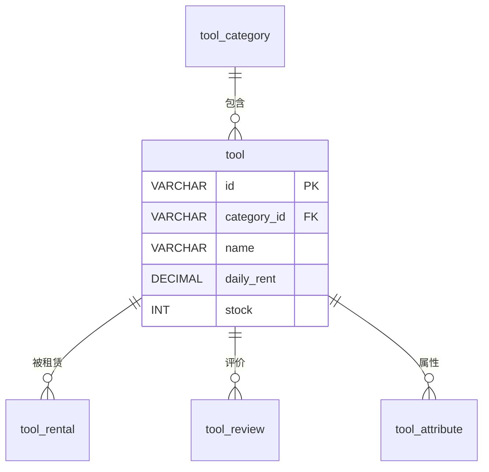

# tool - 工具表

## 表说明

工具信息表，存储可租赁工具的基本信息、价格、库存等。

## 基本信息

| 属性 | 值 |
|------|-----|
| 表名 | tool |
| 引擎 | InnoDB |
| 字符集 | utf8mb4 |
| 排序规则 | utf8mb4_unicode_ci |
| 主键 | VARCHAR(32)（**需核对实际库**：迁移脚本 V7 建表为 INT 自增，但 Tool 实体使用层级编码字符串，如 `05_02_001`，`IdType.INPUT`） |

## 字段列表

| 字段名 | 类型 | 允许空 | 默认值 | 说明 |
|--------|------|--------|--------|------|
| id | VARCHAR(32) | 否 | - | 工具ID（主键，层级编码如 `05_02_001`） |
| category_id | VARCHAR(64) | 是 | NULL | 分类ID（外键） |
| name | VARCHAR(100) | 否 | - | 工具名称 |
| image | VARCHAR(500) | 是 | NULL | 工具主图 |
| images | TEXT | 是 | NULL | 多图（逗号分隔，V32 新增） |
| description | TEXT | 是 | NULL | 工具描述 |
| tags | VARCHAR(200) | 是 | NULL | 标签 |
| price | DECIMAL(10,2) | 是 | NULL | 参考价格 |
| daily_rent | DECIMAL(10,2) | 是 | NULL | 日租金 |
| deposit | DECIMAL(10,2) | 是 | NULL | 押金 |
| free_rent_days | INT | 是 | 0 | 免租天数 |
| stock | INT | 是 | 0 | 总库存 |
| available_stock | INT | 是 | 0 | 可租数量 |
| stock_threshold | INT | 是 | 5 | 库存预警阈值（V37 新增） |
| max_rental_quantity | INT | 是 | 1 | 最大租用量 |
| max_rent_days | INT | 是 | 10 | 最大租用天数（V34 新增） |
| is_pinned | TINYINT | 是 | 0 | 是否置顶（V34 新增） |
| pin_sort | INT | 是 | 0 | 置顶排序（V34 新增） |
| sort_order | INT | 是 | 0 | 综合排序（V34 新增） |
| status | TINYINT | 是 | 1 | 状态: 0下架 1上架 |
| sort | INT | 是 | 0 | 排序 |
| sales | INT | 是 | 0 | 销量（V12 新增） |
| remove | VARCHAR(10) | 是 | '1' | 删除标记（实体有、脚本未单列，需核对实际库） |
| video_type | TINYINT | 是 | NULL | 视频类型（DatabaseInitConfig 运行时补充） |
| video_url | VARCHAR(500) | 是 | NULL | 视频URL（运行时补充） |
| video_cover | VARCHAR(500) | 是 | NULL | 视频封面（运行时补充） |
| video_finder_user_name | VARCHAR(100) | 是 | NULL | 视频号用户名（运行时补充） |
| video_feed_id | VARCHAR(100) | 是 | NULL | 视频feed ID（运行时补充） |
| version | INT | 是 | 0 | 乐观锁版本号 |
| create_time | DATETIME | 是 | CURRENT_TIMESTAMP | 创建时间 |
| update_time | DATETIME | 是 | CURRENT_TIMESTAMP ON UPDATE | 更新时间 |

## 索引

| 索引名 | 索引字段 | 索引类型 | 说明 |
|--------|----------|----------|------|
| PRIMARY | id | 主键索引 | 主键 |
| idx_category_id | category_id | 普通索引 | 分类查询优化 |
| idx_status | status | 普通索引 | 状态筛选优化 |

## 变更历史

- **V7 (2026-03-06)**: 创建工具表
- **V12 (2026-03-07)**: 添加 `sales` 销量字段
- **V32 (2026-04-10)**: 添加 `images` 多图字段
- **V34 (2026-04-10)**: 添加 is_pinned / pin_sort / sort_order / max_rent_days 字段
- **V36**: remove 字段统一为 VARCHAR(10)
- **V37 (2026-08-04)**: 新增 `stock_threshold` 库存预警阈值字段

> **注意**：`tool` 迁移脚本中 id 仍为 `INT AUTO_INCREMENT`、category_id 为 `INT`，但实体 `Tool.id` 实际使用层级编码字符串（如 `05_02_001`，`IdType.INPUT`），实际库结构需核对确认。

## 关联关系

### 作为主表（被引用）

| 关联表 | 外键字段 | 关系类型 | 说明 |
|--------|----------|----------|------|
| [[tool_rental]] | tool_id | 一对多 | 工具可被多次租赁 |
| [[tool_review]] | tool_id | 一对多 | 工具可有多条评价 |
| [[tool_attribute]] | tool_id | 一对多 | 工具可绑定多个属性 |
| [[tool_hot]] | id | 一对多 | 工具可出现在热门中（快照） |
| [[tool_stock_alert_registration]] | tool_id | 一对多 | 工具可有多条缺货登记 |

### 作为从表（引用其他表）

| 主表 | 外键字段 | 关系类型 | 说明 |
|------|----------|----------|------|
| [[tool_category]] | category_id | 多对一 | 工具属于某个分类 |

## 关系图

## 状态说明

| 状态值 | 说明 |
|--------|------|
| 0 | 下架 |
| 1 | 上架 |

## 库存说明

- `stock`: 总库存数量
- `available_stock`: 可租数量（总库存 - 正在租赁中的数量）
- `stock_threshold`: 库存预警阈值，可租数量低于此值触发预警

## 乐观锁说明

本表使用 `version` 字段实现乐观锁，防止并发更新时的数据冲突。