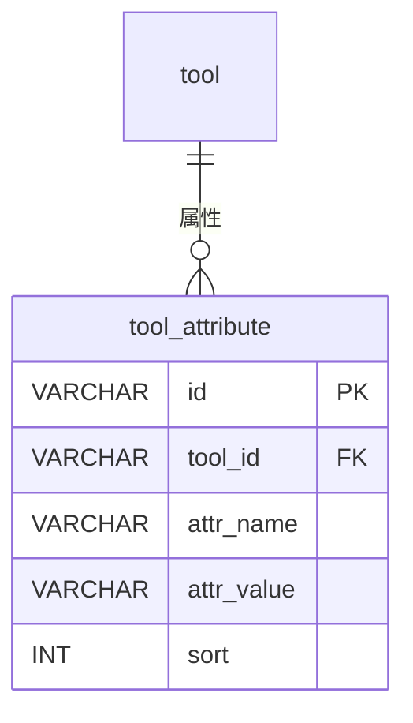

# tool_attribute - 工具属性表

## 表说明

工具属性表，记录工具的自定义属性（名称、值等）。

## 基本信息

| 属性 | 值 |
|------|-----|
| 表名 | tool_attribute |
| 引擎 | InnoDB |
| 字符集 | utf8mb4 |
| 排序规则 | utf8mb4_unicode_ci |
| 主键 | VARCHAR(32)（UUID，V33 创建，实体 `IdType.ASSIGN_UUID`） |

## 字段列表

| 字段名 | 类型 | 允许空 | 默认值 | 说明 |
|--------|------|--------|--------|------|
| id | VARCHAR(32) | 否 | - | 属性ID（主键，UUID） |
| tool_id | VARCHAR(32) | 否 | - | 工具ID（外键） |
| attr_name | VARCHAR(100) | 否 | - | 属性名称 |
| attr_value | VARCHAR(500) | 否 | - | 属性值 |
| sort | INT | 是 | 0 | 排序 |
| create_time | DATETIME | 是 | CURRENT_TIMESTAMP | 创建时间 |
| update_time | DATETIME | 是 | CURRENT_TIMESTAMP ON UPDATE | 更新时间 |

## 变更历史

- **V33**: 创建工具属性表（V33__create_tool_attribute_table.sql）

## 索引

| 索引名 | 索引字段 | 索引类型 | 说明 |
|--------|----------|----------|------|
| PRIMARY | id | 主键索引 | 主键 |
| idx_tool_id | tool_id | 普通索引 | 按工具查询属性 |
| idx_sort | sort | 普通索引 | 排序查询 |

## 关联关系

### 作为从表（引用其他表）

| 主表 | 外键字段 | 关系类型 | 说明 |
|------|----------|----------|------|
| [[tool]] | tool_id | 多对一 | 属性属于某个工具 |

## 关系图

