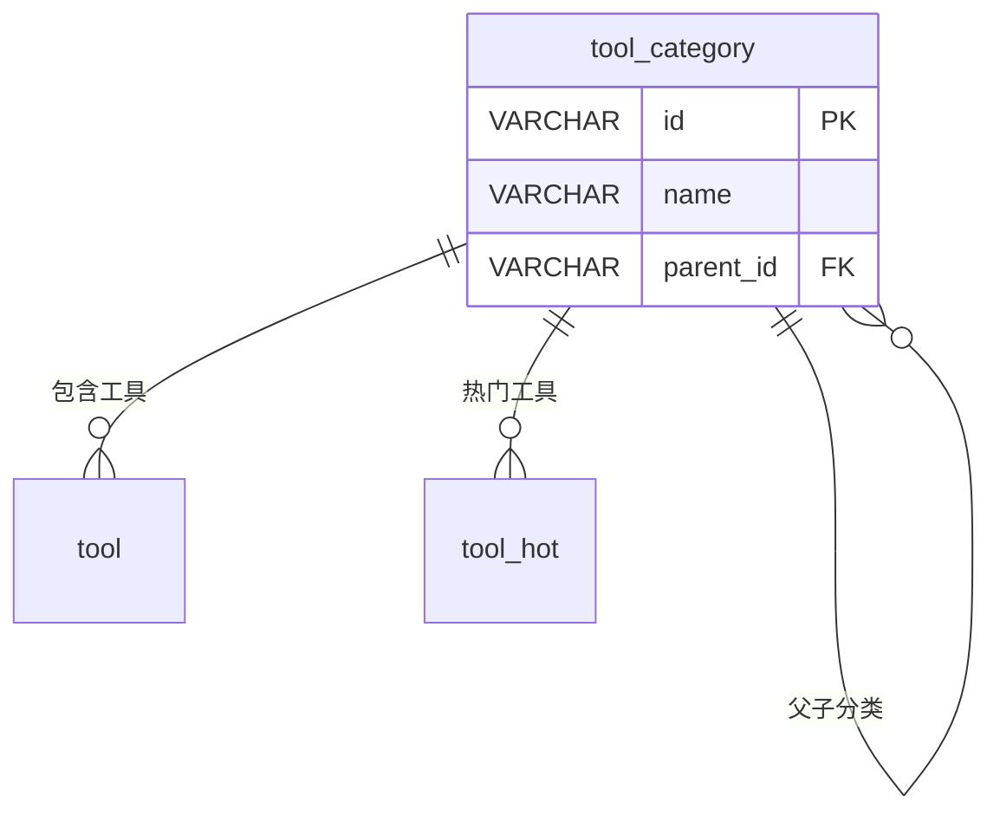

# tool_category - 工具分类表

## 基本信息

| 属性 | 值 |
|------|-----|
| 表名 | tool_category |
| 引擎 | InnoDB |
| 字符集 | utf8mb4 |
| 排序规则 | utf8mb4_unicode_ci |
| 主键 | VARCHAR(32)（**需核对实际库**：迁移脚本 V7 建表为 INT 自增，但 ToolCategory 实体 id/parentId 为 String，`IdType.ASSIGN_ID`） |

## 字段列表

| 字段名 | 类型 | 允许空 | 默认值 | 说明 |
|--------|------|--------|--------|------|
| id | VARCHAR(32) | 否 | - | 分类ID（主键） |
| name | VARCHAR(50) | 否 | - | 分类名称 |
| parent_id | VARCHAR(32) | 是 | NULL | 父分类ID（自关联；实体为 String，需核对） |
| sort | INT | 是 | 0 | 排序 |
| status | TINYINT | 是 | 1 | 状态: 0禁用 1启用 |
| remove | VARCHAR(10) | 是 | NULL | 删除标记（实体有、无迁移脚本，需核对实际库） |
| create_time | DATETIME | 是 | CURRENT_TIMESTAMP | 创建时间 |
| update_time | DATETIME | 是 | CURRENT_TIMESTAMP ON UPDATE | 更新时间 |

## 索引

| 索引名 | 索引字段 | 索引类型 | 说明 |
|--------|----------|----------|------|
| PRIMARY | id | 主键索引 | 主键 |
| idx_parent_id | parent_id | 普通索引 | 父分类查询优化 |

> **注意**：`tool_category` 迁移脚本建表时 id/parent_id 为 INT 自增，但实体用字符串（`ASSIGN_ID`），实际库结构需核对确认。

## 关联关系

### 自关联（树形结构）

| 关联字段 | 关系类型 | 说明 |
|----------|----------|------|
| parent_id | 多对一 | 指向父分类，形成树形结构 |

### 作为主表（被引用）

| 关联表 | 外键字段 | 关系类型 | 说明 |
|--------|----------|----------|------|
| [[tool]] | category_id | 一对多 | 一个分类下有多个工具 |
| [[tool_hot]] | category_id | 一对多 | 一个分类下有多个热门工具 |

## 关系图

## 状态说明

| 状态值 | 说明 |
|--------|------|
| 0 | 禁用 |
| 1 | 启用 |