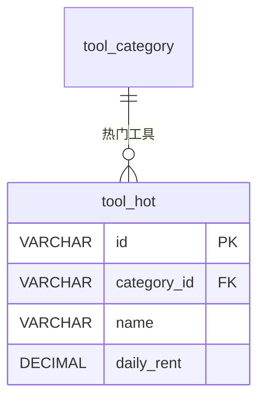

# tool_hot - 热门工具表

## 表说明

热门工具表，存储热门推荐的工具信息（工具快照，可独立管理）。

## 基本信息

| 属性 | 值 |
|------|-----|
| 表名 | tool_hot |
| 引擎 | InnoDB |
| 字符集 | utf8mb4 |
| 排序规则 | utf8mb4_unicode_ci |
| 主键 | VARCHAR(64)（id 与 tool 表 id 对应） |

## 字段列表

| 字段名 | 类型 | 允许空 | 默认值 | 说明 |
|--------|------|--------|--------|------|
| id | VARCHAR(64) | 否 | - | 工具ID（主键，与 tool.id 对应） |
| category_id | VARCHAR(64) | 是 | NULL | 分类ID（外键） |
| name | VARCHAR(100) | 否 | - | 工具名称 |
| image | VARCHAR(500) | 是 | NULL | 图片 |
| description | TEXT | 是 | NULL | 描述 |
| tags | VARCHAR(200) | 是 | NULL | 标签 |
| price | DECIMAL(10,2) | 否 | - | 价格 |
| daily_rent | DECIMAL(10,2) | 否 | - | 日租金 |
| deposit | DECIMAL(10,2) | 否 | - | 押金 |
| free_rent_days | INT | 是 | 0 | 免租天数 |
| stock | INT | 否 | - | 库存 |
| available_stock | INT | 是 | NULL | 可租数量 |
| max_rental_quantity | INT | 是 | 1 | 最大租用量 |
| status | TINYINT | 是 | 1 | 状态: 0下架 1上架 |
| sort | INT | 是 | 0 | 排序 |
| sales | INT | 是 | 0 | 销量 |
| create_time | DATETIME | 是 | CURRENT_TIMESTAMP | 创建时间 |
| update_time | DATETIME | 是 | CURRENT_TIMESTAMP ON UPDATE | 更新时间 |

## 索引

| 索引名 | 索引字段 | 索引类型 | 说明 |
|--------|----------|----------|------|
| PRIMARY | id | 主键索引 | 主键 |
| idx_category_id | category_id | 普通索引 | 分类查询优化 |

## 变更历史

- **V13 (2026-03-07)**: 创建热门工具表
- **V33**: 创建热门工具同步定时任务

## 关联关系

### 作为从表（引用其他表）

| 主表 | 外键字段 | 关系类型 | 说明 |
|------|----------|----------|------|
| [[tool_category]] | category_id | 多对一 | 热门工具属于某个分类 |

## 关系图

## 说明

热门工具表与工具表结构类似，用于在小程序首页展示热门推荐的工具。数据可以通过定时任务从 `tool` 表同步，也可以独立管理。