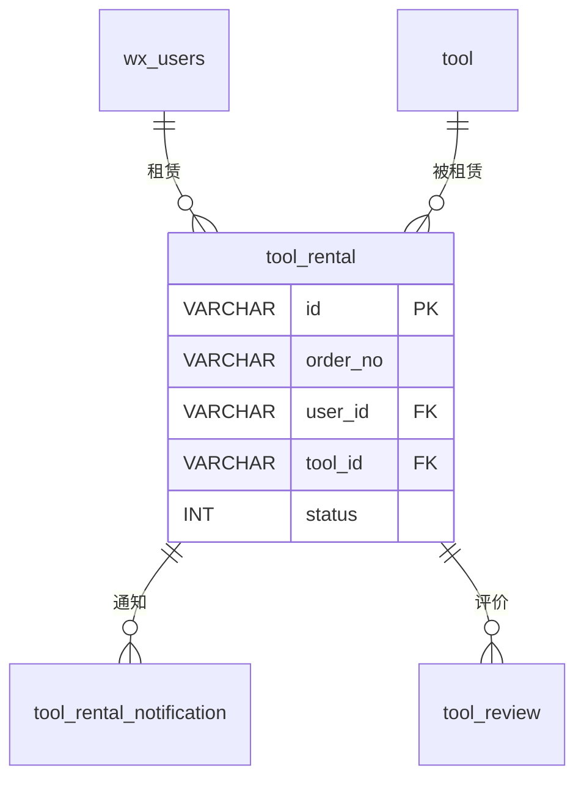
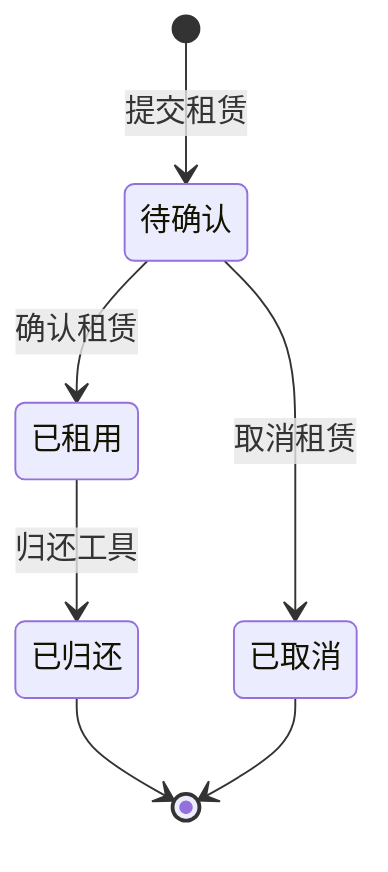

# tool_rental - 工具租赁表

## 表说明

工具租赁记录表，记录用户租赁工具的详细信息。

## 基本信息

| 属性 | 值 |
|------|-----|
| 表名 | tool_rental |
| 引擎 | InnoDB |
| 字符集 | utf8mb4 |
| 排序规则 | utf8mb4_unicode_ci |
| 主键 | VARCHAR(32)（UUID；V31 由 INT 自增改为 VARCHAR(32)，实体 `IdType.ASSIGN_UUID`） |

## 字段列表

| 字段名 | 类型 | 允许空 | 默认值 | 说明 |
|--------|------|--------|--------|------|
| id | VARCHAR(32) | 否 | - | 租赁ID（主键，UUID） |
| order_no | VARCHAR(50) | 否 | - | 租赁订单号 |
| user_id | VARCHAR(32) | 否 | - | 用户ID（外键；V10 由 INT 改 VARCHAR） |
| tool_id | VARCHAR(32) | 否 | - | 工具ID（外键；实体 String，需核对实际库） |
| start_date | DATE | 是 | NULL | 租赁开始日期 |
| end_date | DATE | 是 | NULL | 租赁结束日期 |
| quantity | INT | 是 | NULL | 租赁数量（实体有、无迁移脚本，需核对实际库） |
| total_rent | DECIMAL(10,2) | 是 | NULL | 总租金 |
| deposit | DECIMAL(10,2) | 是 | NULL | 押金 |
| actual_refund_deposit | DECIMAL(10,2) | 是 | NULL | 实际退还押金（V18 新增） |
| actual_paid_rent | DECIMAL(10,2) | 是 | NULL | 实际支付租金（V18 新增） |
| status | TINYINT | 是 | 0 | 状态: 0待确认 1已租用 2已归还 3已取消 |
| qr_code | VARCHAR(200) | 是 | NULL | 二维码 |
| confirm_time | DATETIME | 是 | NULL | 确认时间 |
| return_time | DATETIME | 是 | NULL | 归还时间 |
| remark | VARCHAR(500) | 是 | NULL | 备注 |
| is_reviewed | TINYINT | 是 | 0 | 是否已评价（V29 新增） |
| remove | VARCHAR(10) | 是 | '1' | 删除标记: 0已删除 1未删除（V24 添加，V36 改 VARCHAR） |
| create_time | DATETIME | 是 | CURRENT_TIMESTAMP | 创建时间 |
| update_time | DATETIME | 是 | CURRENT_TIMESTAMP ON UPDATE | 更新时间 |

## 索引

| 索引名 | 索引字段 | 索引类型 | 说明 |
|--------|----------|----------|------|
| PRIMARY | id | 主键索引 | 主键 |
| uk_order_no | order_no | 唯一索引 | 订单号唯一 |
| idx_user_id | user_id | 普通索引 | 用户租赁查询 |
| idx_tool_id | tool_id | 普通索引 | 工具租赁统计 |
| idx_status | status | 普通索引 | 状态筛选 |
| idx_start_date | start_date | 普通索引 | 开始日期查询 |
| idx_end_date | end_date | 普通索引 | 结束日期查询 |
| idx_tool_rental_create_time | create_time | 普通索引 | 日期范围统计（V27 新增） |

## 变更历史

- **V7 (2026-03-06)**: 创建工具租赁表（含 is_operator）
- **V10 (2026-03-07)**: user_id 字段类型由 INT 改为 VARCHAR(32)
- **V18**: 新增 actual_refund_deposit / actual_paid_rent 字段
- **V24**: 新增 remove 软删除字段
- **V27**: 新增 create_time 统计索引
- **V29**: 新增 is_reviewed 字段
- **V31**: id 改为 VARCHAR(32)（UUID）

## 关联关系

### 作为主表（被引用）

| 关联表 | 外键字段 | 关系类型 | 说明 |
|--------|----------|----------|------|
| [[tool_rental_notification]] | rental_id | 一对多 | 一条租赁记录可有多条通知 |
| [[tool_review]] | rental_id | 一对多 | 一条租赁可对应一条评价 |

### 作为从表（引用其他表）

| 主表 | 外键字段 | 关系类型 | 说明 |
|------|----------|----------|------|
| [[wx_users]] | user_id | 多对一 | 租赁属于某个用户 |
| [[tool]] | tool_id | 多对一 | 租赁的是某个工具 |

## 关系图

## 状态说明

| 状态值 | 说明 | 触发条件 |
|--------|------|----------|
| 0 | 待确认 | 用户提交租赁申请 |
| 1 | 已租用 | 管理员确认 |
| 2 | 已归还 | 用户归还工具 |
| 3 | 已取消 | 用户取消或超时 |

## 租赁状态流转

## 删除标记说明

| 值 | 说明 |
|----|------|
| 0 | 已删除 |
| 1 | 未删除 |