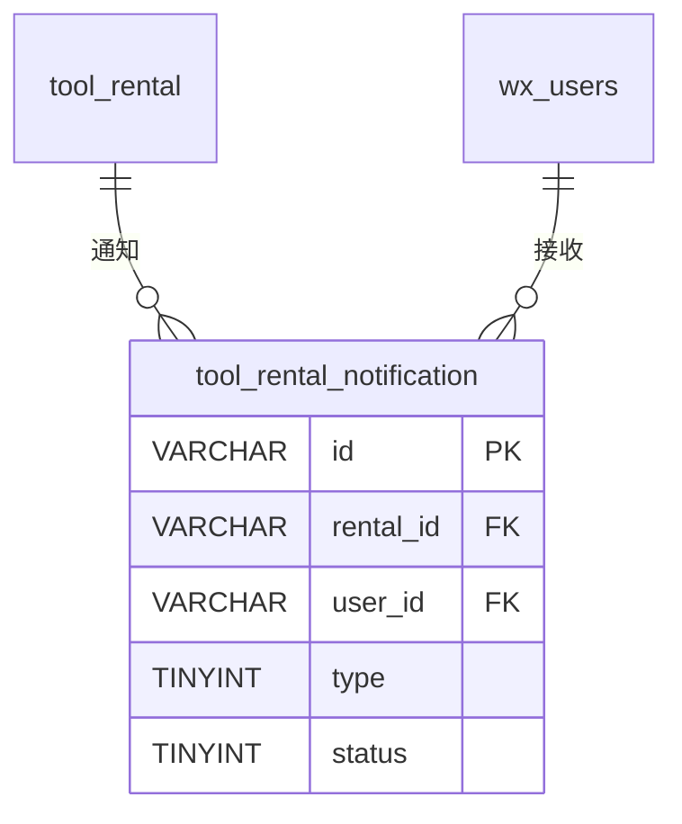

# tool_rental_notification - 租赁通知表

## 表说明

租赁通知记录表，记录发送给用户的租赁相关通知（租用开始、即将到期、已到期、归还确认）。

## 基本信息

| 属性 | 值 |
|------|-----|
| 表名 | tool_rental_notification |
| 引擎 | InnoDB |
| 字符集 | utf8mb4 |
| 排序规则 | utf8mb4_unicode_ci |
| 主键 | VARCHAR(32)（UUID，实体 `IdType.ASSIGN_UUID`） |

## 字段列表

| 字段名 | 类型 | 允许空 | 默认值 | 说明 |
|--------|------|--------|--------|------|
| id | VARCHAR(32) | 否 | - | 通知ID（主键，UUID） |
| rental_id | VARCHAR(32) | 否 | - | 租赁ID（外键；V32 由 BIGINT 改为 VARCHAR(32)） |
| user_id | VARCHAR(64) | 否 | - | 用户ID（外键） |
| openid | VARCHAR(100) | 是 | NULL | 微信OpenID |
| type | TINYINT | 否 | - | 通知类型: 1租用开始 2即将到期 3已到期 4归还确认 |
| status | TINYINT | 是 | 0 | 发送状态: 0待发送 1已发送 2发送失败 |
| error_msg | VARCHAR(500) | 是 | NULL | 错误信息（V26 新增） |
| send_time | DATETIME | 是 | NULL | 发送时间 |
| create_time | DATETIME | 是 | CURRENT_TIMESTAMP | 创建时间 |

## 索引

| 索引名 | 索引字段 | 索引类型 | 说明 |
|--------|----------|----------|------|
| PRIMARY | id | 主键索引 | 主键 |
| idx_rental_id | rental_id | 普通索引 | 租赁通知查询 |
| idx_user_id | user_id | 普通索引 | 用户通知查询 |
| idx_status | status | 普通索引 | 待发送通知轮询 |

## 变更历史

- **V14**: 创建租赁通知表
- **V26**: 新增 error_msg 字段
- **V32**: rental_id 字段类型由 BIGINT 改为 VARCHAR(32)

## 关联关系

### 作为从表（引用其他表）

| 主表 | 外键字段 | 关系类型 | 说明 |
|------|----------|----------|------|
| [[tool_rental]] | rental_id | 多对一 | 通知关联某条租赁记录 |
| [[wx_users]] | user_id | 多对一 | 通知发送给某个用户 |

## 关系图

## 通知类型说明

| 类型值 | 说明 | 触发时机 |
|--------|------|----------|
| 1 | 租用开始 | 租赁确认后 |
| 2 | 即将到期 | 租赁即将到期前 |
| 3 | 已到期 | 租赁到期时 |
| 4 | 归还确认 | 工具归还后 |

## 发送状态说明

| 状态值 | 说明 |
|--------|------|
| 0 | 待发送 |
| 1 | 已发送 |
| 2 | 发送失败 |