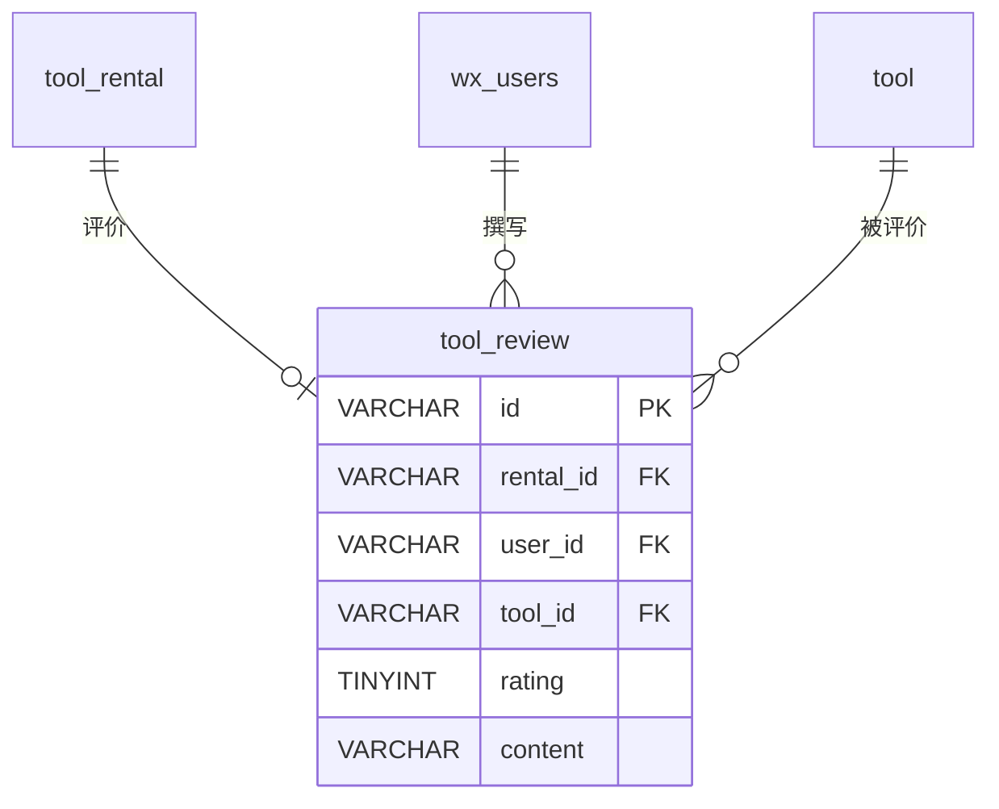

# tool_review - 工具评价表

## 表说明

工具评价表，记录用户对租用工具的评分与评价内容。

## 基本信息

| 属性 | 值 |
|------|-----|
| 表名 | tool_review |
| 引擎 | InnoDB |
| 字符集 | utf8mb4 |
| 排序规则 | utf8mb4_unicode_ci |
| 主键 | VARCHAR(32)（UUID，V30 重建，实体 `IdType.ASSIGN_UUID`） |

## 字段列表

| 字段名 | 类型 | 允许空 | 默认值 | 说明 |
|--------|------|--------|--------|------|
| id | VARCHAR(32) | 否 | - | 评价ID（主键，UUID） |
| rental_id | VARCHAR(32) | 否 | - | 租赁ID（外键，唯一） |
| user_id | VARCHAR(50) | 否 | - | 用户ID（外键） |
| tool_id | VARCHAR(32) | 否 | - | 工具ID（外键） |
| rating | TINYINT | 否 | - | 评分: 1-5星 |
| content | VARCHAR(500) | 是 | NULL | 评价内容 |
| images | VARCHAR(1000) | 是 | NULL | 评价图片 |
| create_time | DATETIME | 是 | CURRENT_TIMESTAMP | 创建时间 |
| update_time | DATETIME | 是 | CURRENT_TIMESTAMP ON UPDATE | 更新时间 |

## 变更历史

- **V30**: 重建工具评价表（主键改 UUID）

## 索引

| 索引名 | 索引字段 | 索引类型 | 说明 |
|--------|----------|----------|------|
| PRIMARY | id | 主键索引 | 主键 |
| uk_rental_id | rental_id | 唯一索引 | 一条租赁对应一条评价 |
| idx_tool_id | tool_id | 普通索引 | 工具评价统计 |
| idx_user_id | user_id | 普通索引 | 用户评价查询 |

## 关联关系

### 作为从表（引用其他表）

| 主表 | 外键字段 | 关系类型 | 说明 |
|------|----------|----------|------|
| [[tool_rental]] | rental_id | 多对一 | 评价针对某条租赁 |
| [[wx_users]] | user_id | 多对一 | 评价来自某个用户 |
| [[tool]] | tool_id | 多对一 | 评价针对某个工具 |

## 关系图

