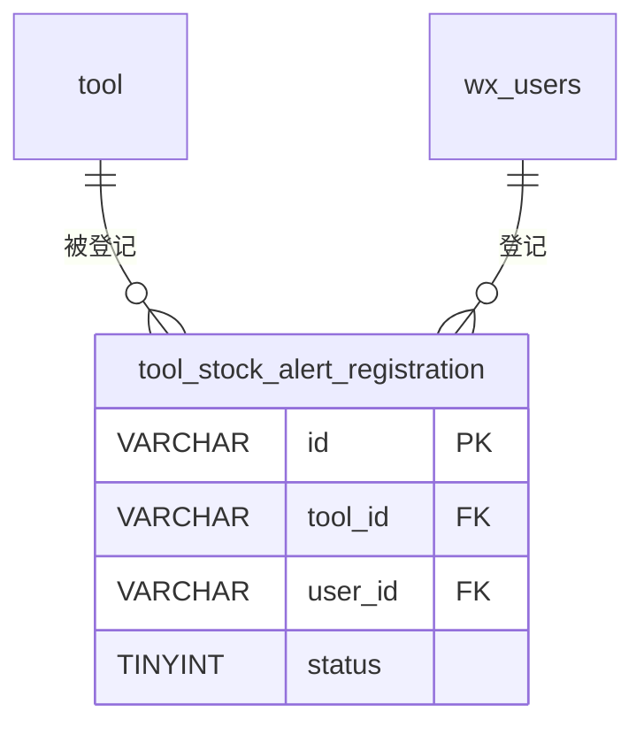

# tool_stock_alert_registration - 工具缺货登记表

## 表说明

工具缺货登记表，记录用户对缺货工具的关注登记，便于缺货到货后通知用户。

## 基本信息

| 属性 | 值 |
|------|-----|
| 表名 | tool_stock_alert_registration |
| 引擎 | InnoDB |
| 字符集 | utf8mb4 |
| 排序规则 | utf8mb4_unicode_ci |
| 主键 | VARCHAR(32) |

## 字段列表

| 字段名 | 类型 | 允许空 | 默认值 | 说明 |
|--------|------|--------|--------|------|
| id | VARCHAR(32) | 否 | - | 登记ID（主键） |
| tool_id | VARCHAR(32) | 否 | - | 工具ID（外键） |
| user_id | VARCHAR(32) | 否 | - | 用户ID（外键） |
| remark | VARCHAR(200) | 是 | NULL | 备注 |
| status | TINYINT | 是 | 0 | 状态: 0未处理 1已处理 |
| create_time | DATETIME | 是 | CURRENT_TIMESTAMP | 创建时间 |
| update_time | DATETIME | 是 | CURRENT_TIMESTAMP ON UPDATE | 更新时间 |

## 索引

| 索引名 | 索引字段 | 索引类型 | 说明 |
|--------|----------|----------|------|
| PRIMARY | id | 主键索引 | 主键 |
| idx_tool_id | tool_id | 普通索引 | 按工具查询登记 |
| idx_status | status | 普通索引 | 按处理状态查询 |
| uk_user_tool | user_id, tool_id | 唯一索引 | 同一用户对同一工具仅登记一次 |

## 关联关系

### 作为从表（引用其他表）

| 主表 | 外键字段 | 关系类型 | 说明 |
|------|----------|----------|------|
| [[tool]] | tool_id | 多对一 | 登记针对某个缺货工具 |
| [[wx_users]] | user_id | 多对一 | 登记来自某个用户 |

## 关系图

## 处理状态说明

| 状态值 | 说明 |
|--------|------|
| 0 | 未处理 |
| 1 | 已处理 |