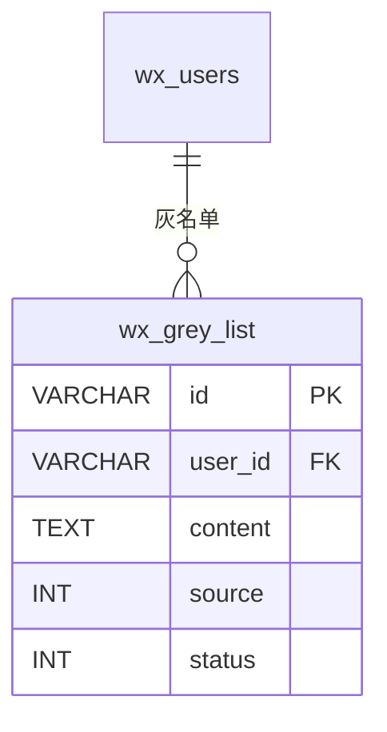

# wx_grey_list - 用户灰名单表

## 表说明

小程序用户灰名单表，记录被标记为灰名单的用户信息。

## 基本信息

| 属性 | 值 |
|------|-----|
| 表名 | wx_grey_list |
| 引擎 | InnoDB |
| 字符集 | utf8mb4 |
| 排序规则 | utf8mb4_unicode_ci |
| 主键 | VARCHAR(32)（UUID） |

## 字段列表

| 字段名 | 类型 | 允许空 | 默认值 | 说明 |
|--------|------|--------|--------|------|
| id | VARCHAR(32) | 否 | - | 记录ID（主键） |
| user_id | VARCHAR(32) | 是 | NULL | 用户ID（外键，关联 wx_users.id） |
| content | TEXT | 是 | NULL | 灰名单内容 |
| images | TEXT | 是 | NULL | 相关图片（JSON数组） |
| source | TINYINT | 否 | - | 添加来源: 1管理后台 2小程序 |
| creator_id | VARCHAR(50) | 否 | - | 添加人ID |
| status | TINYINT | 是 | 1 | 状态: 0无效 1有效 |
| remove | VARCHAR(10) | 是 | '1' | 删除标记: 0已删除 1未删除（V36 由 TINYINT 改 VARCHAR） |
| create_time | DATETIME | 是 | CURRENT_TIMESTAMP | 创建时间 |
| update_time | DATETIME | 是 | CURRENT_TIMESTAMP ON UPDATE | 更新时间 |

## 索引

| 索引名 | 索引字段 | 索引类型 | 说明 |
|--------|----------|----------|------|
| PRIMARY | id | 主键索引 | 主键 |
| idx_user_id | user_id | 普通索引 | 按用户查询灰名单 |

## 变更历史

- **V11 (2026-03-07)**: 创建灰名单表
- **V36**: remove 字段由 TINYINT 改为 VARCHAR(10)

## 关联关系

### 作为从表（引用其他表）

| 主表 | 外键字段 | 关系类型 | 说明 |
|------|----------|----------|------|
| [[wx_users]] | user_id | 多对一 | 灰名单记录关联某个用户 |

## 关系图

## 添加来源说明

| 来源值 | 说明 |
|--------|------|
| 1 | 管理后台添加 |
| 2 | 小程序端添加 |

## 状态说明

| 状态值 | 说明 |
|--------|------|
| 0 | 无效 |
| 1 | 有效 |

## 删除标记说明

| 值 | 说明 |
|----|------|
| 0 | 已删除 |
| 1 | 未删除 |