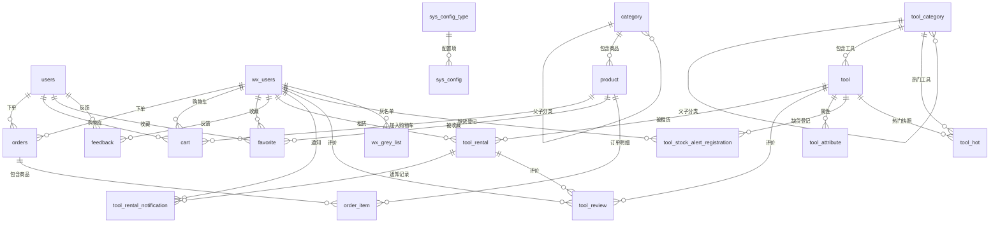
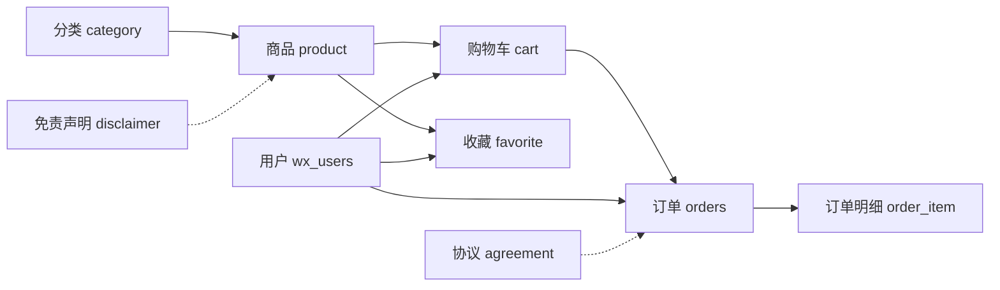
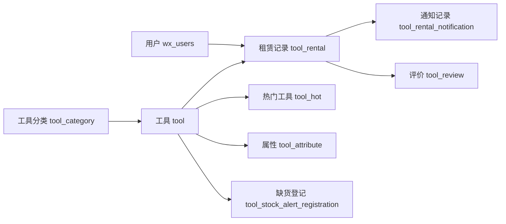

# 社区超市数据库设计文档

> **数据库名称**: supermarket
> **字符集**: utf8mb4
> **排序规则**: utf8mb4_unicode_ci
> **数据库版本**: V39
> **同步时间**: 2026-08-21

## 数据库概览

本数据库服务于社区超市小程序（taobao-wechat 项目），包含以下模块：

| 模块   | 说明                            | 相关表                                                                                                                                                              |
| ---- | ----------------------------- | ---------------------------------------------------------------------------------------------------------------------------------------------------------------- |
| 用户管理 | 管理后台用户和小程序用户                  | [[users]], [[wx_users]], [[wx_grey_list]]                                                                                                                        |
| 商品管理 | 商品分类和商品信息                     | [[category]], [[product]]                                                                                                                                        |
| 购物车  | 用户购物车                         | [[cart]]                                                                                                                                                         |
| 收藏   | 用户收藏商品                        | [[favorite]]                                                                                                                                                     |
| 订单管理 | 订单和订单明细                       | [[orders]], [[order_item]]                                                                                                                                       |
| 工具租赁 | 工具分类、工具、租赁记录、通知、评价、属性、热门、缺货登记 | [[tool_category]], [[tool]], [[tool_rental]], [[tool_rental_notification]], [[tool_review]], [[tool_attribute]], [[tool_hot]], [[tool_stock_alert_registration]] |
| 意见反馈 | 用户反馈                          | [[feedback]]                                                                                                                                                     |
| 系统配置 | 系统参数配置、定时任务、协议、免责声明           | [[sys_config]], [[sys_config_type]], [[sys_schedule_config]], [[agreement]], [[disclaimer]]                                                                      |

## 表关系图 (Mermaid)

## 核心业务关系图

### 商品业务流程

### 工具租赁业务流程

## 表清单

| 序号 | 表名 | 说明 | 关联表 |
| --- | ---- | ---- | ------ |
| 1 | [[users]] | 管理后台用户表 | - |
| 2 | [[wx_users]] | 小程序用户表 | orders, cart, favorite, feedback, tool_rental, tool_rental_notification, tool_review, tool_stock_alert_registration |
| 3 | [[wx_grey_list]] | 用户灰名单表 | wx_users |
| 4 | [[category]] | 商品分类表 | category(自关联), product |
| 5 | [[product]] | 商品表 | category, cart, favorite, order_item |
| 6 | [[cart]] | 购物车表 | wx_users, product |
| 7 | [[favorite]] | 收藏表 | wx_users, product |
| 8 | [[orders]] | 订单表 | wx_users, order_item |
| 9 | [[order_item]] | 订单明细表 | orders, product |
| 10 | [[feedback]] | 意见反馈表 | wx_users |
| 11 | [[tool_category]] | 工具分类表 | tool_category(自关联), tool |
| 12 | [[tool]] | 工具表 | tool_category, tool_rental, tool_review, tool_attribute, tool_hot, tool_stock_alert_registration |
| 13 | [[tool_hot]] | 热门工具表 | tool_category, tool |
| 14 | [[tool_rental]] | 工具租赁表 | wx_users, tool, tool_rental_notification, tool_review |
| 15 | [[tool_rental_notification]] | 租赁通知表 | tool_rental, wx_users |
| 16 | [[tool_review]] | 工具评价表 | tool_rental, tool, wx_users |
| 17 | [[tool_attribute]] | 工具属性表 | tool |
| 18 | [[tool_stock_alert_registration]] | 工具缺货登记表 | tool, wx_users |
| 19 | [[sys_config]] | 系统配置表 | sys_config_type |
| 20 | [[sys_config_type]] | 配置类型表 | sys_config |
| 21 | [[sys_schedule_config]] | 定时任务配置表 | - |
| 22 | [[agreement]] | 协议表 | - |
| 23 | [[disclaimer]] | 免责声明表 | - |

## 外键关系汇总

### 外键关系一览表

| 从表 | 外键字段 | 主表 | 主键字段 | 关系类型 |
| ---- | -------- | ---- | -------- | -------- |
| product | category_id | category | id | 多对一 |
| cart | user_id | wx_users | id | 多对一 |
| cart | product_id | product | id | 多对一 |
| favorite | user_id | wx_users | id | 多对一 |
| favorite | product_id | product | id | 多对一 |
| orders | user_id | wx_users | id | 多对一 |
| order_item | order_id | orders | id | 多对一 |
| order_item | product_id | product | id | 多对一 |
| feedback | user_id | wx_users | id | 多对一 |
| category | parent_id | category | id | 自关联 |
| tool | category_id | tool_category | id | 多对一 |
| tool_category | parent_id | tool_category | id | 自关联 |
| tool_rental | user_id | wx_users | id | 多对一 |
| tool_rental | tool_id | tool | id | 多对一 |
| tool_rental_notification | rental_id | tool_rental | id | 多对一 |
| tool_rental_notification | user_id | wx_users | id | 多对一 |
| tool_review | rental_id | tool_rental | id | 多对一 |
| tool_review | user_id | wx_users | id | 多对一 |
| tool_review | tool_id | tool | id | 多对一 |
| tool_attribute | tool_id | tool | id | 多对一 |
| tool_hot | category_id | tool_category | id | 多对一 |
| tool_stock_alert_registration | tool_id | tool | id | 多对一 |
| tool_stock_alert_registration | user_id | wx_users | id | 多对一 |
| wx_grey_list | user_id | wx_users | id | 多对一 |
| sys_config | config_type | sys_config_type | config_type | 多对一 |

## 命名规范

- 表名：小写字母，使用下划线分隔（如 `order_item`）
- 主键：`id`（V33 后统一为 VARCHAR(32) 字符串 / UUID；wx_users 为 VARCHAR(64)；users 等沿用 VARCHAR(32)）
- 外键：`{关联表名}_id`（如 `user_id`, `product_id`）
- 时间字段：`create_time`, `update_time`
- 状态字段：`status`（0/1/2 等数字状态）
- 删除标记：`remove`（V36 后统一为 VARCHAR(10)，'0'已删除 '1'未删除）
- 金额字段：`DECIMAL(10,2)` 类型

> **注意**：`tool` / `tool_category` 的迁移脚本仍为 INT 自增，但实体 `Tool.id` 实际使用层级编码字符串（如 `05_02_001`），实际库结构需核对确认。

## 索引设计

### 常用索引

| 表名 | 索引名 | 索引字段 | 类型 | 说明 |
| ---- | ------ | -------- | ---- | ---- |
| users | uk_username | username | 唯一索引 | 用户名唯一 |
| wx_users | uk_openid | openid | 唯一索引 | openid 唯一 |
| wx_users | idx_wx_users_phone | phone | 普通索引 | 手机号查询 |
| orders | uk_order_no | order_no | 唯一索引 | 订单号唯一 |
| cart | uk_user_product | user_id, product_id | 唯一索引 | 用户商品唯一 |
| favorite | uk_user_product | user_id, product_id | 唯一索引 | 用户商品唯一 |
| product | idx_category | category_id | 普通索引 | 分类查询 |
| orders | idx_user | user_id | 普通索引 | 用户订单查询 |
| cart | idx_user | user_id | 普通索引 | 用户购物车查询 |
| sys_config | idx_config_type | config_type | 普通索引 | 配置类型查询 |
| tool_rental | idx_tool_rental_create_time | create_time | 普通索引 | 日期范围统计 |
| tool_rental | uk_order_no | order_no | 唯一索引 | 租赁订单号唯一 |
| sys_schedule_config | uk_task_name | task_name | 唯一索引 | 任务名唯一 |